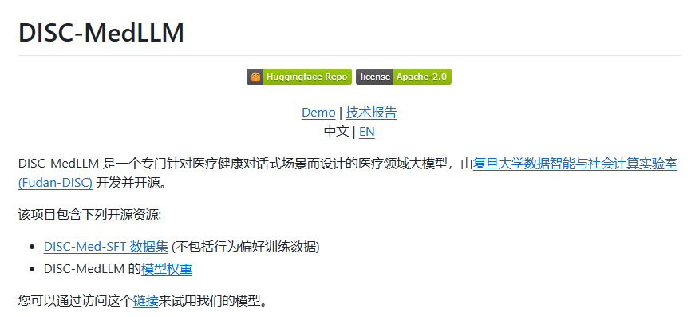
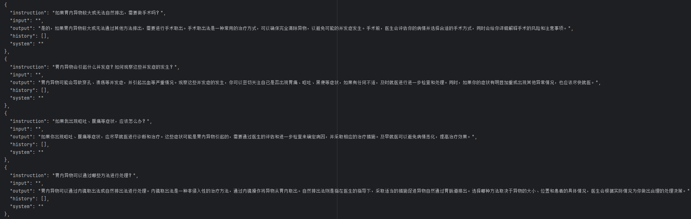
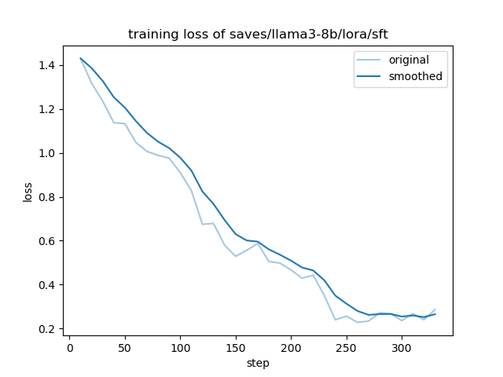
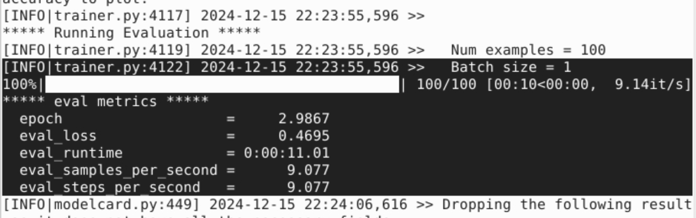
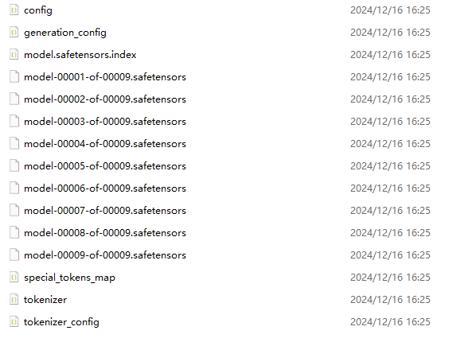
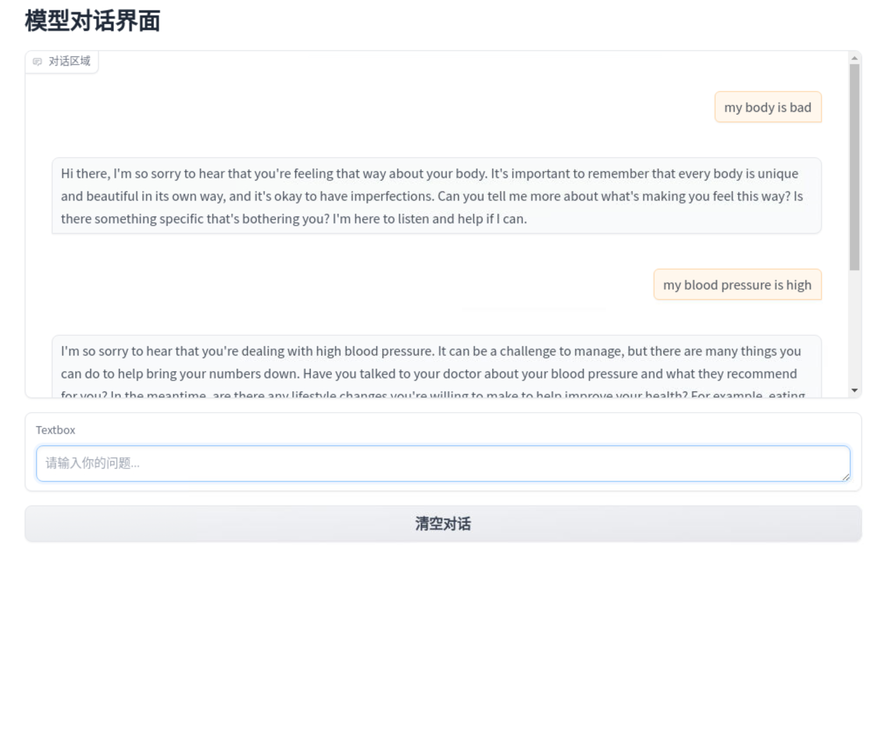
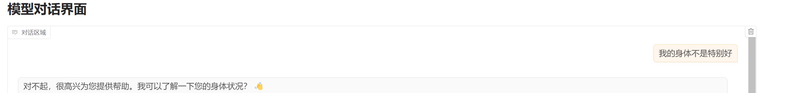
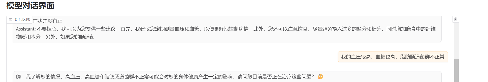
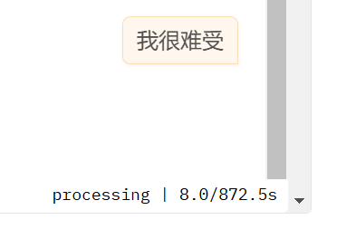

# LLaMA 老年关怀中文 QA 系统部署流程详解

我们从中文数据集微调 LLaMA 模型（含 LoRA 适配器）到合并模型、搭建可访问的 Web UI 界面进行对话，以及在 GPU 上实现加速的完整流程，并示例在训练中查看 loss 曲线、过程截图和对话界面等。

## 前提条件与准备

- **硬件准备**：  
  在RTX4090 GPU（本地，输入输出支持中文）和远程服务器（搭载8块A100，仅支持英文输入输出）上进行，加速推理与微调过程。

- **软件环境**：  
  - Python 3.8+  
  - 已安装 `transformers`、`torch`、`gradio`、`datasets`、`pyyaml`、`llamafactory-cli` 等工具。

- **数据准备**：  
  已有针对老年人就医的中文对话数据集（如问候、叮嘱健康、闲聊关怀等）。将数据通过如下脚本转化成 Alpaca 指令微调格式准备，并在 `dataset_info.json` 中为数据集（`"my_converted_alpaca"`）添加对应条目信息。
 ```python
import json

input_file = r"E:\clone\LLaMA-Factory\DISC-Med-SFT\DISC-Med-SFT_released.jsonl"
output_file = r"E:\clone\LLaMA-Factory\DISC-Med-SFT\converted_alpaca.json"

alpaca_data = []

with open(input_file, "r", encoding="utf-8") as f:
    for line in f:
        line = line.strip()
        if not line:
            continue
        record = json.loads(line)

        conversation = record.get("conversation", [])
        pairs = [(turn["role"], turn["content"]) for turn in conversation]

        history_pairs = []
        # 寻找 (user -> assistant) 对
        for i in range(len(pairs) - 1):
            curr_role, curr_text = pairs[i]
            next_role, next_text = pairs[i + 1]

            if curr_role == "user" and next_role == "assistant":
                # 构造 history
                translated_history = []
                for h_inst, h_out in history_pairs:
                    translated_history.append([h_inst, h_out])

                item = {
                    "instruction": curr_text,
                    "input": "",
                    "output": next_text,
                    "history": translated_history,
                    "system": ""
                }
                alpaca_data.append(item)

                history_pairs.append((curr_text, next_text))

# 将所有处理后的数据写入输出文件
with open(output_file, "w", encoding="utf-8") as f_out:
    json.dump(alpaca_data, f_out, ensure_ascii=False, indent=2)

print(f"转换完成，共生成 {len(alpaca_data)} 条Alpaca格式数据。")
```
<div style="text-align: center;">
  
  <br>
  <div style="color: orange; border-bottom: 1px solid #d9d9d9; display: inline-block; padding: 2px;">数据集来源</div>
</div>
<div style="text-align: center;">
  
  <br>
  <div style="color: orange; border-bottom: 1px solid #d9d9d9; display: inline-block; padding: 2px;">转换后数据集格式 </div>
</div>
## 中文数据集微调（SFT阶段）

1. **数据标注与格式化**：  
   将中文老年与医生对话数据集整理为适合 LLaMA 微调的格式后，在 `dataset_info.json` 中定义数据集。确保数据包含清晰的指令（instruction）、用户输入（input）和回答（output）字段。

2. **使用 LoRA 进行指令微调 (SFT)**：  
   利用 `llamafactory-cli` 进行微调（llama源代码中的 `examples/train_lora/llama3_lora_sft.yaml` 配置文件）：
   在配置文件中指定：
   - `stage: sft`
   - `finetuning_type: lora`

   微调完成后，`output_dir` 中将产生 `adapter_model.safetensors`、`tokenizer_config.json`、`special_tokens_map.json` 等文件。

3. **训练过程可视化**：  
   开启 `plot_loss: true`，已记录并绘制 loss 曲线如下，方便观察收敛情况。

<div style="text-align: center;">
  
  <br>
  <div style="color: orange; border-bottom: 1px solid #d9d9d9; display: inline-block; padding: 2px;">loss曲线 </div>
</div>

   从图中可见，随 epoch 推进，loss 逐渐下降。

4. **过程截图**：  
   在终端中可查看训练过程日志与中间保存的 checkpoints。
<div style="text-align: center;">
  
  <br>
  <div style="color: orange; border-bottom: 1px solid #d9d9d9; display: inline-block; padding: 2px;">过程截图 </div>
</div>

## LoRA 适配器合并与模型导出
**合并 LoRA 适配器**：  
   使用 `llamafactory-cli export` 命令和合并配置文件（也是源码中的`examples/merge_lora/llama3_lora_sft.yaml`）将已微调的 LoRA 适配器与预训练模型合并：

   合并成功后，在 `export_dir`（ `models/llama3_lora_sft`）生成多分片 `model-xxxx-of-xxxx.safetensors` 等文件，即为完整独立的模型权重。
<div style="text-align: center;">
  
  <br>
  <div style="color: orange; border-bottom: 1px solid #d9d9d9; display: inline-block; padding: 2px;">训练后模型截图 </div>
</div>


## 搭建 Gradio Web UI 进行中英文对话
因为llama没有中文数据集，所以在微调后的模型在回答上会有一定程度乱码，并且由于硬件设备限制加上模型较大，所以在本地上大约600s生成回复而在服务器上大约是12s，但是从文本上不影响正常交流。
1. **安装 Gradio**：


2. **编写 `app.py`**：  
   合并后模型在 `E:/clone/LLaMA-Factory/models/llama3_lora_sft` 下：
   ```python
   import torch
   import gradio as gr
   from transformers import AutoTokenizer, AutoModelForCausalLM

   model_name = "E:/clone/LLaMA-Factory/models/llama3_lora_sft"
   tokenizer = AutoTokenizer.from_pretrained(model_name, use_fast=False)
   model = AutoModelForCausalLM.from_pretrained(model_name, torch_dtype=torch.bfloat16, device_map="auto")

   def format_conversation(history):
       # history为 [{"role":"user","content":"..."},{"role":"assistant","content":"..."}]
       # 根据微调时的格式选择合适的模板。例如这里使用简单的User/Assistant格式：
       conv = ""
       for turn in history:
           if turn['role'] == 'user':
               conv += f"User: {turn['content']}\n"
           else:
               conv += f"Assistant: {turn['content']}\n"
       conv += "Assistant:"  # 等待模型回答
       return conv

   def user_submit(user_message, history):
       if history is None:
           history = []
       history.append({"role":"user","content":user_message})
       return history, ""

   def bot_respond(history):
       conversation = format_conversation(history)
       inputs = tokenizer(conversation, return_tensors='pt').to(model.device)
       with torch.no_grad():
           outputs = model.generate(**inputs, max_new_tokens=200, do_sample=False, temperature=0.1)
       answer = tokenizer.decode(outputs[0][inputs['input_ids'].shape[1]:], skip_special_tokens=True)
       history.append({"role":"assistant","content":answer.strip()})
       return history

   with gr.Blocks() as demo:
       gr.Markdown("# 老年关怀中文QA对话界面")
       chatbot = gr.Chatbot(label="对话区域", type="messages")
       msg = gr.Textbox(placeholder="请输入你的问题...")
       clear = gr.Button("清空对话")

       msg.submit(user_submit, [msg, chatbot], [chatbot, msg], queue=False).then(bot_respond, chatbot, chatbot)
       clear.click(lambda: [], None, chatbot, queue=False)

   demo.launch(server_name="0.0.0.0", server_port=7860, share=False)
   ```

3. **访问界面**：  
   运行 `python app.py` 后，在浏览器访问 [http://localhost:7860](http://localhost:7860) 即可看到 Web UI。

<div style="text-align: center;">
  
  <br>
  <div style="color: orange; border-bottom: 1px solid #d9d9d9; display: inline-block; padding: 2px;">服务器问答截图 </div>
</div>
<div style="text-align: center;">
  
  <br>
  <div style="color: orange; border-bottom: 1px solid #d9d9d9; display: inline-block; padding: 2px;">服务器问答时间截图 </div>
</div>
<div style="text-align: center;">
  
  <br>
  <div style="color: orange; border-bottom: 1px solid #d9d9d9; display: inline-block; padding: 2px;">本地问答1 </div>
</div>
<div style="text-align: center;">
  
  <br>
  <div style="color: orange; border-bottom: 1px solid #d9d9d9; display: inline-block; padding: 2px;">本地问答2 </div>
</div>
<div style="text-align: center;">
  
  <br>
  <div style="color: orange; border-bottom: 1px solid #d9d9d9; display: inline-block; padding: 2px;">本地问答时间截图 </div>
</div>


## 因为回复时间过长使用 GPU 加速（上图为最快时间）

- 已在 `from_pretrained()` 时指定 `device_map="auto"` 与 `torch_dtype`，模型将自动使用 GPU。
- 若显存不足，请考虑量化或使用更小的模型。减少 `max_new_tokens` 或不加载过长上下文。

## 问题与优化方法

- **中文回答与期待不符**：  
  确保对话格式与微调时一致，调整 `temperature` 和 `do_sample` 参数。可先清空对话，单轮测试模型响应情况。
  
- **加载缓慢**：  
  硬件问题。
  
- 显存不足 ：

## 总结

总之，通过以上步骤，我们使用中文数据集对 LLaMA 模型进行老年关怀 QA 场景的微调（SFT），并利用 LoRA 减少训练开销。合并适配器后可获得单独可用的模型文件。借助 Gradio 快速搭建 Web UI，使他人能通过浏览器进行对话交互。在 GPU 加速下，模型响应更快。遇到回答不相干问题，不断微调 prompt 格式与参数配置，以实现更自然、更有温度的老年关怀中文对话系统。
```